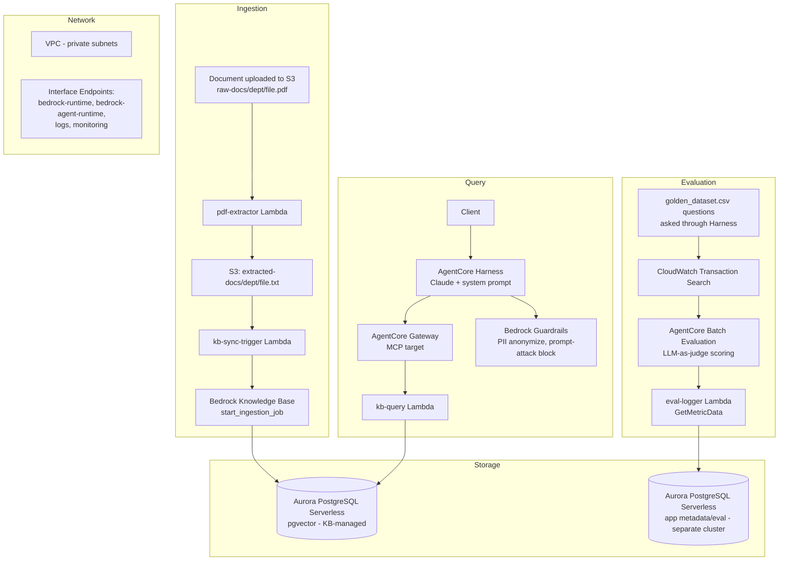

# Architecture

## Why this shape, not a simpler one

**Two separate Aurora clusters, not one.** The Knowledge Base's vector
store is created and owned by Bedrock internally when the Knowledge Base
is configured with a custom vector store. The application's own
audit/eval data (chat history, eval_runs) lives on a second, independently
provisioned cluster. Mixing Bedrock-managed internals with
application-owned tables in one database is avoidable complexity with no
upside.

**A separate PDF-extraction stage, not direct PDF ingestion.** Bedrock
Knowledge Bases offer a "Foundation model as a parser" option that reads
PDF pages as images via a vision model. In this project that approach
silently dropped a nested bullet list of specific policy figures from one
document -- it didn't fail, it just produced an incomplete transcription
with no error signal. For plain, text-based policy PDFs (the overwhelming
majority of real enterprise documents), extracting the PDF's actual
embedded text layer with a proper PDF library is both more reliable and
cheaper, since it skips an LLM call per page. The image-based parser still
has a real use case -- scanned documents with no text layer, or pages that
are genuinely visual (charts, diagrams) -- just not this one.

**AgentCore Harness + Gateway + a plain Lambda, not the Gateway's
built-in Knowledge Base connector.** AgentCore Gateway ships a
pre-configured "Connectors" target specifically for Knowledge Bases --
but per AWS's own documentation, it only supports the "Managed Knowledge
Base" type, where Bedrock also owns the vector store choice. This
project's Knowledge Base uses a custom Aurora pgvector store (a
deliberate choice, since OpenSearch Serverless has an always-on billing
floor that doesn't suit a cost-constrained project), which the built-in
connector doesn't support. The Gateway instead points to a plain Lambda
that calls `bedrock-agent-runtime.retrieve_and_generate` directly --
functionally equivalent, and it keeps the cheaper, scale-to-zero vector
store.

**VPC Interface Endpoints for Bedrock, Logs, and Monitoring -- no NAT
Gateway.** Every AWS service a VPC-isolated Lambda needs to reach
requires either a NAT Gateway (a single resource covering all outbound
traffic, but a meaningfully larger continuous cost) or its own Interface
Endpoint (cheaper per-service, but each one is itself a small continuous
cost scoped to the number of Availability Zones it's deployed into).
Given the project's cost constraints, Endpoints scoped to 1-2 AZs were
chosen over a NAT Gateway -- a real trade-off, not a default.

## Known limitations / explicitly deferred

- **No authenticated end-user client yet.** The only way to query the
  system today is the AgentCore Harness playground inside the AWS
  console, which requires AWS credentials. A real "end user" experience
  needs a front-end calling the Harness's `invoke_agent_runtime` API
  behind an API Gateway + Cognito, which is a natural next phase but
  wasn't built in this pass.
- **MLOps pipeline has no quality gate.** New documents are automatically
  re-ingested on upload, but nothing currently blocks a sync if it would
  degrade retrieval quality (e.g., a malformed upload). A production
  version would run a quick eval check post-sync and alert/roll back on
  regression, using the same evaluation infrastructure already built.
- **2 of 20 golden-dataset questions still fail**, traced to incomplete
  content from manual PDF regeneration during debugging, not a system
  defect -- documented rather than chased to zero given time constraints.
