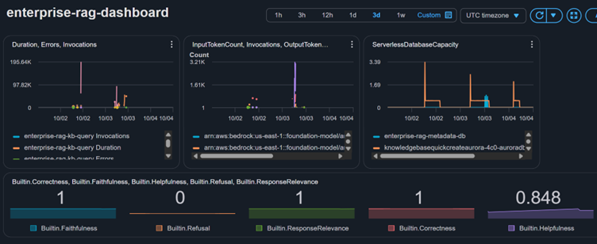

# Observability

A CloudWatch dashboard and two alarms cover the pipeline's health and
cost, built after a budget alert caught an unexpectedly high forecasted
spend mid-project (see "Cost notes" in the root README).

## Dashboard widgets

| Widget | Metrics | Why it's here |
|---|---|---|
| Lambda health | Invocations, Errors, Duration — `kb-query`, `pdf-extractor`, `kb-sync-trigger` | Core pipeline functions; a spike in Errors or Duration is the first sign something broke |
| Bedrock usage | Invocations, InputTokenCount, OutputTokenCount | Token usage is the main usage-based cost driver in this stack |
| Aurora capacity | ServerlessDatabaseCapacity, both clusters | Confirms both clusters are actually scaling to 0 ACU when idle, not silently stuck running (the root cause of an earlier cost spike was a different resource — see below — but this is the same failure mode and worth watching) |
| Evaluation scores | Correctness, Faithfulness, Response relevance, Refusal, Helpfulness (namespace `Bedrock-AgentCore/Evaluations`) | Same metrics the eval-logger Lambda reads — visible on the dashboard as well as persisted to Postgres |

## Alarms

| Alarm | Condition | Why |
|---|---|---|
| `kb-query-errors` | `Errors > 0` on the main query Lambda | Any single failure on the user-facing function should be known immediately, not discovered manually |
| `aurora-not-scaling-down` | `ServerlessDatabaseCapacity > 0.5` ACU sustained for 30 min | Catches a cluster stuck running instead of scaling to 0 — directly tied to the cost incident below |

Both publish to a single SNS topic (`enterprise-rag-alerts`) with an
email subscription.

## A real cost incident this caught (or would have)

Mid-project, two AWS Budget alerts fired: actual spend at \$20.87 and a
**forecasted** month-end cost of \$113 against an \$80 budget. Cost
Explorer showed the breakdown: VPC Interface Endpoints at \$12.25 (51%
of spend), versus \$8.19 for all actual Bedrock/AgentCore/SageMaker usage
combined. The endpoints had been created across all 6 Availability Zones
in the default VPC — correct for production-grade redundancy, unnecessary
for a personal project, and billing per-AZ continuously regardless of
use, unlike nearly everything else in the stack (Lambda, Bedrock, and
Aurora Serverless v2 all scale to near-zero when idle).

Fix: reduced each endpoint from 6 AZs down to 2. This dashboard and the
Aurora alarm exist specifically so a similar "quietly non-zero, always-on
resource" doesn't go unnoticed again.
